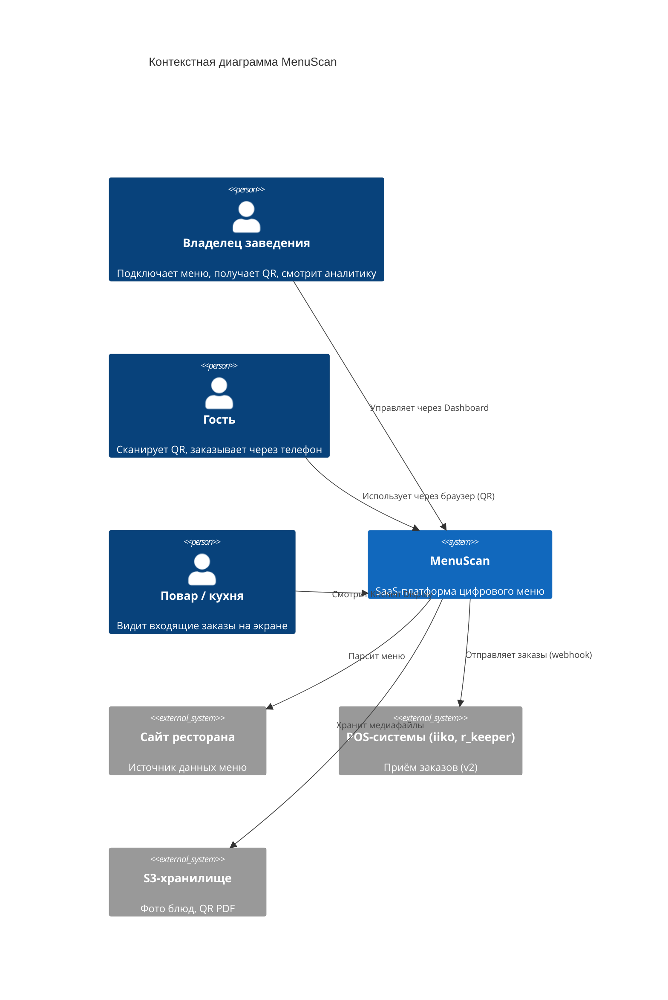
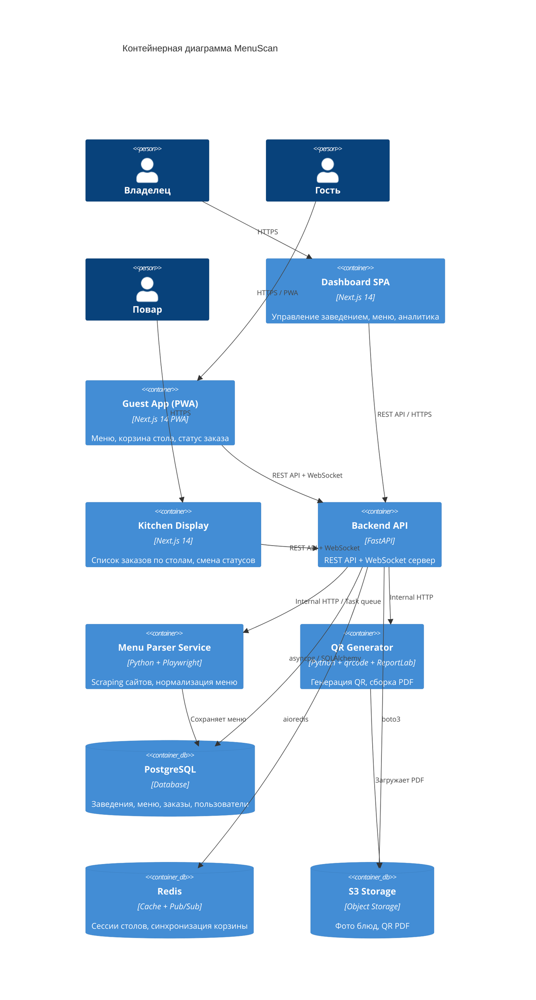
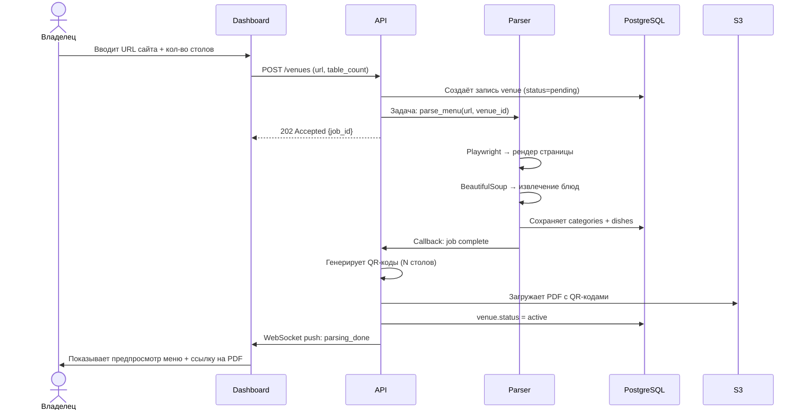
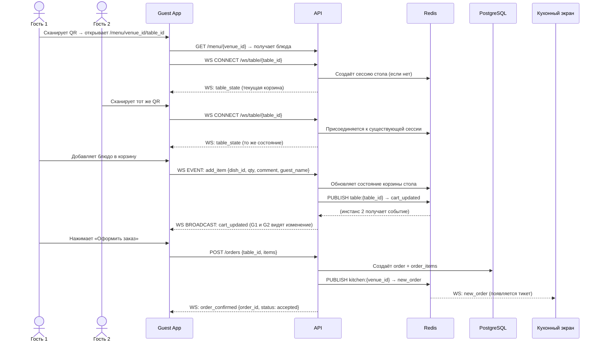
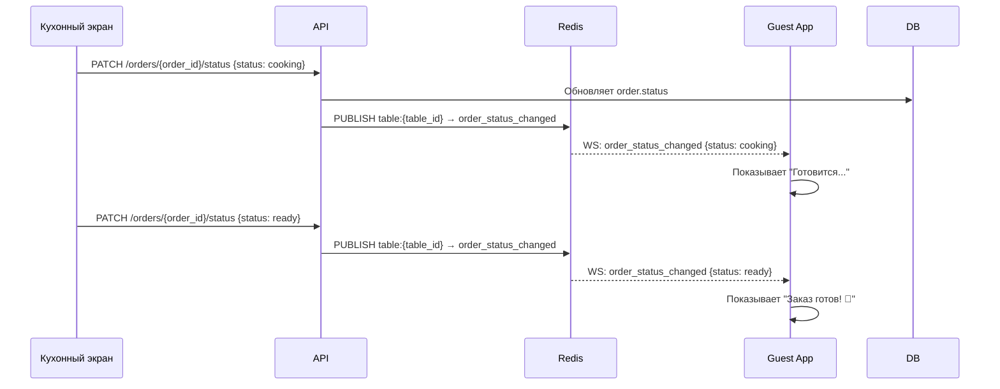
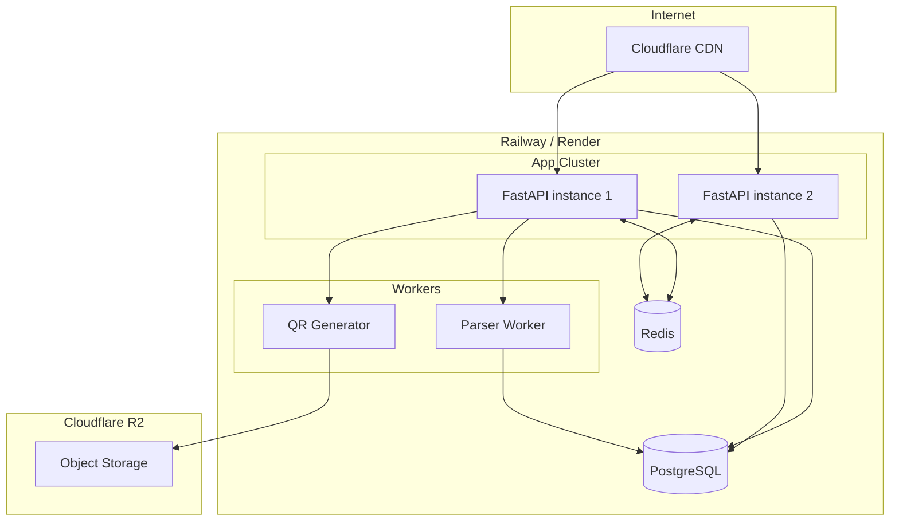

# Архитектура системы — MenuScan

> Версия: 1.0

---

## 1. Обзор стека

| Слой | Технология | Обоснование |
|---|---|---|
| Backend API | FastAPI (Python) | Async из коробки, автодокументация, типизация |
| WebSocket | FastAPI WebSocket + Redis Pub/Sub | Масштабируемая синхронизация между инстансами |
| База данных | PostgreSQL 16 | Реляционные данные, JSONB для гибкого меню |
| Кэш / очереди | Redis 7 | Pub/Sub для WS, кэш меню, сессии столов |
| Парсер | Playwright + BeautifulSoup4 | Поддержка JS-рендеренных страниц |
| Frontend (Dashboard) | Next.js 14 (App Router) | SSR для SEO, React для интерактивности |
| Frontend (Гость / Кухня) | Next.js 14 PWA | Один фреймворк, офлайн-поддержка |
| Хранилище файлов | S3-совместимый (MinIO / Cloudflare R2) | Фото блюд, QR PDF |
| Генерация QR | `qrcode` (Python lib) + ReportLab | Пакетная генерация PDF |
| Деплой | Docker Compose → Railway / Render | Простой старт, лёгкий переезд |
| CI/CD | GitHub Actions | Авто-тесты + деплой на push |

---

## 2. Общая архитектура (C4 — Context)

---

## 3. Компонентная архитектура (C4 — Container)

---

## 4. Поток данных — подключение заведения

---

## 5. Поток данных — гость за столом

---

## 6. Поток данных — смена статуса заказа

---

## 7. Инфраструктура деплоя

---

## 8. Решения по ключевым техническим вопросам

### 8.1 Синхронизация корзины между устройствами
**Решение:** Redis Pub/Sub.  
Каждый WebSocket-хэндлер подписывается на канал `table:{table_id}`. При любом изменении корзины API публикует событие в Redis — все подключённые клиенты стола мгновенно получают обновление. Это работает и при горизонтальном масштабировании (несколько инстансов API).

### 8.2 Парсер — JS-рендеренные сайты
**Решение:** Playwright headless browser.  
Запускается как отдельный Worker-процесс. Получает задачи через внутренний HTTP. Лимит: одна задача парсинга не дольше 60 сек, после — fallback на ручной ввод.

### 8.3 Идентификация гостя
**Решение:** Анонимная сессия.  
При первом открытии генерируется `guest_id` (UUID) в localStorage. Гость вводит имя (опционально). Нет регистрации — снижаем порог входа до нуля.

### 8.4 Масштабирование WebSocket
**Решение:** Redis Pub/Sub как message broker между инстансами.  
Клиент может подключиться к любому инстансу API — все синхронизированы через Redis.

### 8.5 Консистентность корзины
**Решение:** Корзина хранится в Redis (быстрый доступ) и реплицируется в PostgreSQL при оформлении заказа. TTL сессии стола — 4 часа (сбрасывается при активности).
