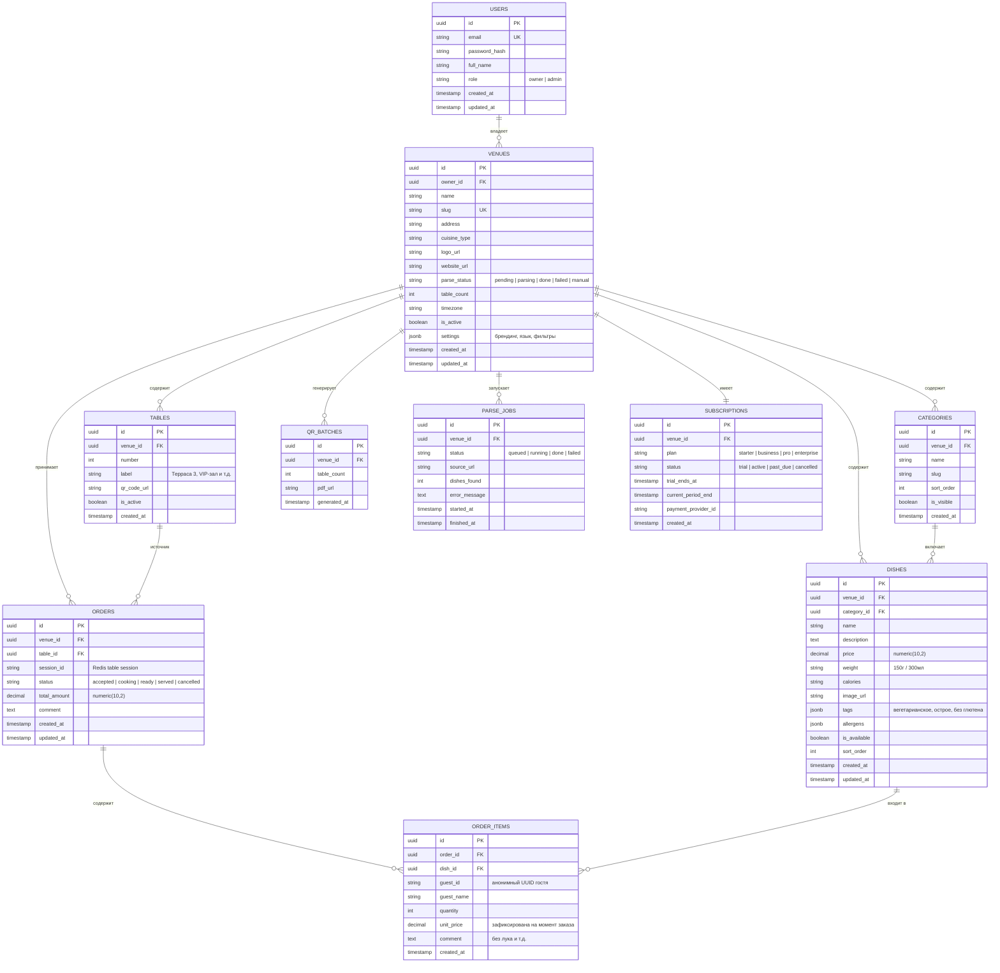

# Схема базы данных — MenuScan

> СУБД: PostgreSQL 16  
> Версия схемы: 1.0

---

## 1. ERD — полная схема



---

## 2. Описание таблиц

### `users`
Владельцы заведений. Авторизация через email/password или Google OAuth.

```sql
CREATE TABLE users (
    id          UUID PRIMARY KEY DEFAULT gen_random_uuid(),
    email       VARCHAR(255) UNIQUE NOT NULL,
    password_hash VARCHAR(255),
    full_name   VARCHAR(255),
    role        VARCHAR(50) DEFAULT 'owner' CHECK (role IN ('owner', 'admin')),
    created_at  TIMESTAMPTZ DEFAULT NOW(),
    updated_at  TIMESTAMPTZ DEFAULT NOW()
);
```

---

### `venues`
Заведение. Центральная сущность системы.

```sql
CREATE TABLE venues (
    id              UUID PRIMARY KEY DEFAULT gen_random_uuid(),
    owner_id        UUID NOT NULL REFERENCES users(id) ON DELETE CASCADE,
    name            VARCHAR(255) NOT NULL,
    slug            VARCHAR(100) UNIQUE NOT NULL,  -- для URL меню
    address         TEXT,
    cuisine_type    VARCHAR(100),
    logo_url        TEXT,
    website_url     TEXT,
    parse_status    VARCHAR(50) DEFAULT 'pending'
                    CHECK (parse_status IN ('pending','parsing','done','failed','manual')),
    table_count     INT DEFAULT 0,
    timezone        VARCHAR(100) DEFAULT 'Europe/Moscow',
    is_active       BOOLEAN DEFAULT true,
    settings        JSONB DEFAULT '{}',
    created_at      TIMESTAMPTZ DEFAULT NOW(),
    updated_at      TIMESTAMPTZ DEFAULT NOW()
);

-- Пример settings JSONB:
-- {
--   "primary_color": "#FF6B35",
--   "language": "ru",
--   "show_calories": true,
--   "filters_enabled": ["vegetarian", "spicy", "gluten_free"]
-- }
```

---

### `tables`
Столы заведения. Каждый стол имеет уникальный QR-код.

```sql
CREATE TABLE tables (
    id          UUID PRIMARY KEY DEFAULT gen_random_uuid(),
    venue_id    UUID NOT NULL REFERENCES venues(id) ON DELETE CASCADE,
    number      INT NOT NULL,
    label       VARCHAR(100),
    qr_code_url TEXT,
    is_active   BOOLEAN DEFAULT true,
    created_at  TIMESTAMPTZ DEFAULT NOW(),
    UNIQUE(venue_id, number)
);
```

---

### `categories`
Разделы меню (Завтраки, Супы, Горячее, Напитки и т.д.).

```sql
CREATE TABLE categories (
    id          UUID PRIMARY KEY DEFAULT gen_random_uuid(),
    venue_id    UUID NOT NULL REFERENCES venues(id) ON DELETE CASCADE,
    name        VARCHAR(255) NOT NULL,
    slug        VARCHAR(100) NOT NULL,
    sort_order  INT DEFAULT 0,
    is_visible  BOOLEAN DEFAULT true,
    created_at  TIMESTAMPTZ DEFAULT NOW(),
    UNIQUE(venue_id, slug)
);
```

---

### `dishes`
Блюда меню. JSONB-поля для гибкой работы с тегами и аллергенами.

```sql
CREATE TABLE dishes (
    id           UUID PRIMARY KEY DEFAULT gen_random_uuid(),
    venue_id     UUID NOT NULL REFERENCES venues(id) ON DELETE CASCADE,
    category_id  UUID REFERENCES categories(id) ON DELETE SET NULL,
    name         VARCHAR(255) NOT NULL,
    description  TEXT,
    price        NUMERIC(10, 2) NOT NULL,
    weight       VARCHAR(50),     -- '150г', '300мл', '2 шт'
    calories     VARCHAR(50),     -- '320 ккал'
    image_url    TEXT,
    tags         JSONB DEFAULT '[]',      -- ["vegetarian","spicy"]
    allergens    JSONB DEFAULT '[]',      -- ["gluten","nuts"]
    is_available BOOLEAN DEFAULT true,
    sort_order   INT DEFAULT 0,
    created_at   TIMESTAMPTZ DEFAULT NOW(),
    updated_at   TIMESTAMPTZ DEFAULT NOW()
);

CREATE INDEX idx_dishes_venue_id ON dishes(venue_id);
CREATE INDEX idx_dishes_category_id ON dishes(category_id);
CREATE INDEX idx_dishes_tags ON dishes USING GIN(tags);
```

---

### `orders`
Заказ стола. Создаётся при нажатии «Оформить заказ».

```sql
CREATE TABLE orders (
    id           UUID PRIMARY KEY DEFAULT gen_random_uuid(),
    venue_id     UUID NOT NULL REFERENCES venues(id),
    table_id     UUID NOT NULL REFERENCES tables(id),
    session_id   VARCHAR(100) NOT NULL,  -- Redis table session ID
    status       VARCHAR(50) DEFAULT 'accepted'
                 CHECK (status IN ('accepted','cooking','ready','served','cancelled')),
    total_amount NUMERIC(10, 2),
    comment      TEXT,
    created_at   TIMESTAMPTZ DEFAULT NOW(),
    updated_at   TIMESTAMPTZ DEFAULT NOW()
);

CREATE INDEX idx_orders_venue_id ON orders(venue_id);
CREATE INDEX idx_orders_table_id ON orders(table_id);
CREATE INDEX idx_orders_status ON orders(status);
CREATE INDEX idx_orders_created_at ON orders(created_at DESC);
```

---

### `order_items`
Позиции заказа. Цена фиксируется на момент заказа.

```sql
CREATE TABLE order_items (
    id          UUID PRIMARY KEY DEFAULT gen_random_uuid(),
    order_id    UUID NOT NULL REFERENCES orders(id) ON DELETE CASCADE,
    dish_id     UUID NOT NULL REFERENCES dishes(id),
    guest_id    VARCHAR(100) NOT NULL,   -- анонимный UUID из localStorage
    guest_name  VARCHAR(100),
    quantity    INT NOT NULL DEFAULT 1,
    unit_price  NUMERIC(10, 2) NOT NULL, -- зафиксирована при создании заказа
    comment     TEXT,
    created_at  TIMESTAMPTZ DEFAULT NOW()
);

CREATE INDEX idx_order_items_order_id ON order_items(order_id);
```

---

### `parse_jobs`
Задачи парсинга меню с сайта ресторана.

```sql
CREATE TABLE parse_jobs (
    id            UUID PRIMARY KEY DEFAULT gen_random_uuid(),
    venue_id      UUID NOT NULL REFERENCES venues(id) ON DELETE CASCADE,
    status        VARCHAR(50) DEFAULT 'queued'
                  CHECK (status IN ('queued','running','done','failed')),
    source_url    TEXT NOT NULL,
    dishes_found  INT DEFAULT 0,
    error_message TEXT,
    started_at    TIMESTAMPTZ,
    finished_at   TIMESTAMPTZ
);
```

---

### `subscriptions`
Тарифный план заведения.

```sql
CREATE TABLE subscriptions (
    id                   UUID PRIMARY KEY DEFAULT gen_random_uuid(),
    venue_id             UUID NOT NULL REFERENCES venues(id) ON DELETE CASCADE,
    plan                 VARCHAR(50) DEFAULT 'starter'
                         CHECK (plan IN ('starter','business','pro','enterprise')),
    status               VARCHAR(50) DEFAULT 'trial'
                         CHECK (status IN ('trial','active','past_due','cancelled')),
    trial_ends_at        TIMESTAMPTZ,
    current_period_end   TIMESTAMPTZ,
    payment_provider_id  VARCHAR(255),  -- ID в платёжной системе (Stripe, ЮКасса)
    created_at           TIMESTAMPTZ DEFAULT NOW(),
    UNIQUE(venue_id)
);
```

---

## 3. Redis — структуры данных

### Сессия стола (Hash)
```
KEY: table_session:{venue_id}:{table_id}
TTL: 4 часа (сбрасывается при активности)

HSET table_session:{venue_id}:{table_id}
  session_id     "uuid"
  created_at     "ISO timestamp"
  guests         "[{guest_id, guest_name, connected_at}]"  -- JSON string
  cart           "[{dish_id, name, price, qty, comment, guest_id, guest_name}]"  -- JSON string
  last_activity  "ISO timestamp"
```

### Канал Pub/Sub (WebSocket sync)
```
CHANNEL: table:{table_id}
CHANNEL: kitchen:{venue_id}
```

### Кэш меню
```
KEY:  menu_cache:{venue_id}
TTL:  15 минут
VAL:  JSON строка с полным меню (categories + dishes)
```

---

## 4. Миграции

Используем **Alembic** (автогенерация из SQLAlchemy моделей).

```
alembic/
  versions/
    0001_initial_schema.py
    0002_add_subscriptions.py
    ...
  env.py
  alembic.ini
```

Порядок применения миграций:
```bash
alembic upgrade head       # применить все
alembic downgrade -1       # откатить одну
alembic revision --autogenerate -m "add_column_x"
```
