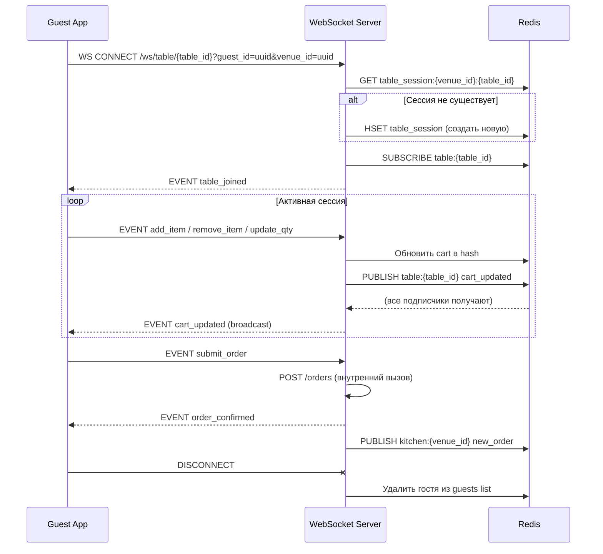
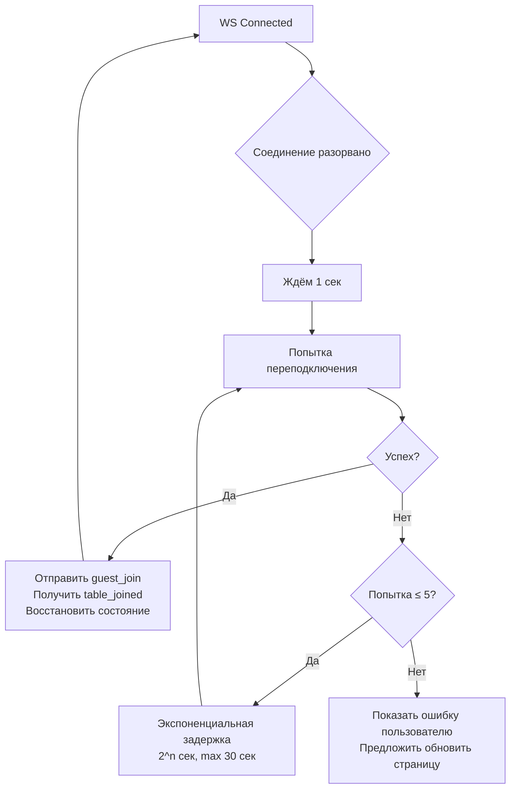

# WebSocket Events — MenuScan

> Протокол: WebSocket (ws:// / wss://)  
> Формат сообщений: JSON  
> Библиотека клиента: нативный WebSocket API браузера

---

## 1. Эндпоинты подключения

| Эндпоинт | Кто подключается | Назначение |
|---|---|---|
| `wss://api.menuscan.io/ws/table/{table_id}` | Гость | Синхронизация корзины стола |
| `wss://api.menuscan.io/ws/kitchen/{venue_id}` | Кухонный экран | Входящие заказы и статусы |
| `wss://api.menuscan.io/ws/dashboard/{venue_id}` | Владелец | Статусы заказов и уведомления |

---

## 2. Формат сообщения

Все сообщения — JSON с обязательными полями `type` и `payload`.

```json
{
  "type": "EVENT_TYPE",
  "payload": { ... },
  "timestamp": "2026-01-15T19:35:00Z"
}
```

---

## 3. Подключение к столу (`/ws/table/{table_id}`)

### Жизненный цикл соединения



---

## 4. События — клиент → сервер

### `guest_join`
Отправляется сразу после установки соединения. Регистрирует гостя в сессии стола.

```json
{
  "type": "guest_join",
  "payload": {
    "guest_id": "550e8400-e29b-41d4-a716-446655440000",
    "guest_name": "Алексей",
    "venue_id": "uuid"
  }
}
```

---

### `add_item`
Гость добавляет блюдо в корзину.

```json
{
  "type": "add_item",
  "payload": {
    "dish_id": "uuid",
    "dish_name": "Яйца Бенедикт",
    "unit_price": 490.00,
    "quantity": 1,
    "comment": "без лука",
    "guest_id": "uuid",
    "guest_name": "Алексей"
  }
}
```

---

### `remove_item`
Гость удаляет позицию из корзины (только свою).

```json
{
  "type": "remove_item",
  "payload": {
    "cart_item_id": "local-uuid",
    "guest_id": "uuid"
  }
}
```

---

### `update_qty`
Изменение количества позиции.

```json
{
  "type": "update_qty",
  "payload": {
    "cart_item_id": "local-uuid",
    "quantity": 3,
    "guest_id": "uuid"
  }
}
```

---

### `submit_order`
Оформление заказа всего стола.

```json
{
  "type": "submit_order",
  "payload": {
    "table_comment": "Поздравляем с днём рождения!"
  }
}
```

---

### `call_waiter`
Вызов официанта (без заказа).

```json
{
  "type": "call_waiter",
  "payload": {
    "table_id": "uuid",
    "message": ""
  }
}
```

---

### `ping`
Heartbeat от клиента (каждые 30 сек).

```json
{
  "type": "ping",
  "payload": {}
}
```

---

## 5. События — сервер → клиент (Table)

### `table_joined`
Подтверждение подключения + текущее состояние стола.

```json
{
  "type": "table_joined",
  "payload": {
    "session_id": "uuid",
    "table": {
      "id": "uuid",
      "number": 5,
      "label": "Стол 5"
    },
    "guests": [
      { "guest_id": "uuid", "guest_name": "Мария" },
      { "guest_id": "uuid", "guest_name": "Алексей" }
    ],
    "cart": [
      {
        "cart_item_id": "local-uuid",
        "dish_id": "uuid",
        "dish_name": "Капучино",
        "unit_price": 220.00,
        "quantity": 2,
        "comment": "",
        "guest_id": "uuid",
        "guest_name": "Мария"
      }
    ],
    "total": 440.00
  }
}
```

---

### `guest_connected`
Новый гость присоединился к столу (broadcast).

```json
{
  "type": "guest_connected",
  "payload": {
    "guest_id": "uuid",
    "guest_name": "Дмитрий"
  }
}
```

---

### `guest_disconnected`
Гость отключился от стола (broadcast).

```json
{
  "type": "guest_disconnected",
  "payload": {
    "guest_id": "uuid",
    "guest_name": "Дмитрий"
  }
}
```

---

### `cart_updated`
Обновление корзины (broadcast всем за столом).

```json
{
  "type": "cart_updated",
  "payload": {
    "action": "add",
    "cart_item": {
      "cart_item_id": "local-uuid",
      "dish_id": "uuid",
      "dish_name": "Яйца Бенедикт",
      "unit_price": 490.00,
      "quantity": 1,
      "comment": "без лука",
      "guest_id": "uuid",
      "guest_name": "Алексей"
    },
    "cart": [ ... ],
    "total": 1280.00
  }
}
```

Поле `action`: `"add"` | `"remove"` | `"update"`.

---

### `order_confirmed`
Заказ успешно оформлен и принят кухней.

```json
{
  "type": "order_confirmed",
  "payload": {
    "order_id": "uuid",
    "status": "accepted",
    "total_amount": 1280.00,
    "created_at": "2026-01-15T19:35:00Z"
  }
}
```

---

### `order_status_changed`
Статус заказа изменился (кухня нажала кнопку).

```json
{
  "type": "order_status_changed",
  "payload": {
    "order_id": "uuid",
    "status": "cooking",
    "updated_at": "2026-01-15T19:37:00Z"
  }
}
```

Статусы: `accepted` → `cooking` → `ready` → `served`.

---

### `error`
Ошибка обработки события.

```json
{
  "type": "error",
  "payload": {
    "code": "ITEM_NOT_AVAILABLE",
    "message": "Блюдо временно недоступно"
  }
}
```

---

### `pong`
Ответ на heartbeat.

```json
{
  "type": "pong",
  "payload": {}
}
```

---

## 6. События — Kitchen Display (`/ws/kitchen/{venue_id}`)

### Подключение
```
wss://api.menuscan.io/ws/kitchen/{venue_id}?token={kitchen_token}
```

---

### `kitchen_connected` (сервер → кухня)
Начальное состояние при подключении.

```json
{
  "type": "kitchen_connected",
  "payload": {
    "active_orders": [
      {
        "order_id": "uuid",
        "table": { "number": 3, "label": "Стол 3" },
        "status": "accepted",
        "total_amount": 760.00,
        "created_at": "2026-01-15T19:20:00Z",
        "items": [
          {
            "dish_name": "Борщ",
            "quantity": 2,
            "comment": "",
            "guest_name": "Сергей"
          }
        ]
      }
    ]
  }
}
```

---

### `new_order` (сервер → кухня)
Новый заказ поступил.

```json
{
  "type": "new_order",
  "payload": {
    "order_id": "uuid",
    "table": { "number": 5, "label": "Стол 5" },
    "status": "accepted",
    "total_amount": 1280.00,
    "created_at": "2026-01-15T19:35:00Z",
    "items": [
      {
        "dish_name": "Яйца Бенедикт",
        "quantity": 2,
        "comment": "без лука",
        "guest_name": "Алексей"
      },
      {
        "dish_name": "Капучино",
        "quantity": 3,
        "comment": "",
        "guest_name": "Мария"
      }
    ]
  }
}
```

---

### `update_order_status` (кухня → сервер)
Повар меняет статус заказа.

```json
{
  "type": "update_order_status",
  "payload": {
    "order_id": "uuid",
    "status": "cooking"
  }
}
```

---

### `order_status_updated` (сервер → кухня, broadcast)
Подтверждение смены статуса (обновить UI).

```json
{
  "type": "order_status_updated",
  "payload": {
    "order_id": "uuid",
    "status": "ready"
  }
}
```

---

## 7. Reconnect-логика (клиент)



Задержки переподключения: 1с, 2с, 4с, 8с, 16с, 30с (далее не растёт).

---

## 8. Безопасность

| Угроза | Защита |
|---|---|
| Чужой стол изменяет корзину | Валидация `guest_id` из сессии Redis при каждой операции |
| Спам событиями | Rate limit: max 10 WS-событий/сек с одного соединения |
| Подключение к кухне без PIN | `kitchen_token` в query param, проверяется при handshake |
| Истёкшая сессия стола | TTL в Redis 4ч; при истечении — новая сессия при следующем сканировании |
