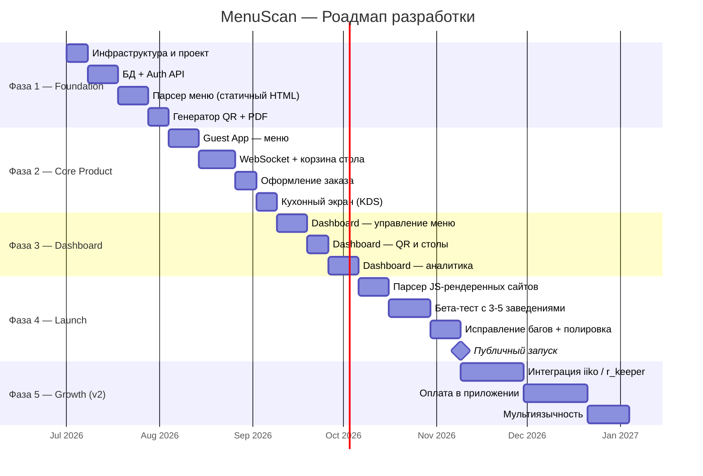

# Роадмап разработки — MenuScan

> Соло-разработка  
> Стек: FastAPI + PostgreSQL + Redis + Next.js

---

## Обзор фаз



---

## Фаза 1 — Foundation (4 недели)

**Цель:** Рабочий бэкенд, парсер, генерация QR.

### Неделя 1 — Инфраструктура
- [ ] Инициализация репозитория (monorepo: `backend/`, `frontend/`, `docs/`)
- [ ] Docker Compose: FastAPI + PostgreSQL + Redis
- [ ] Alembic: первичная схема БД (users, venues, tables, categories, dishes)
- [ ] CI/CD: GitHub Actions (lint + tests на push)
- [ ] `.env.example`, структура проекта, README

### Неделя 2 — Auth + Venues API
- [ ] `POST /auth/register`, `POST /auth/login`, JWT middleware
- [ ] `CRUD /venues` — создание, список, обновление
- [ ] `CRUD /tables` — автогенерация столов при создании venue
- [ ] `CRUD /categories` + `CRUD /dishes`
- [ ] Unit-тесты на auth и venues

### Неделя 3 — Парсер меню
- [ ] Parser Worker: отдельный процесс, BeautifulSoup4
- [ ] Поддержка статичного HTML (Tilda, простые сайты)
- [ ] Нормализация данных: название, цена, граммовка, категория
- [ ] `GET /venues/{id}/parse-status` — polling статуса
- [ ] Fallback: импорт через CSV (`name, price, weight, category`)
- [ ] Ручное редактирование результатов парсинга

### Неделя 4 — QR-коды
- [ ] Генерация QR через `qrcode` (URL = `https://menu.menuscan.io/{slug}/table/{n}`)
- [ ] Сборка PDF (ReportLab): 4 QR на лист A4, номер стола, название заведения
- [ ] Загрузка PDF в S3 (MinIO local / Cloudflare R2 prod)
- [ ] `GET /venues/{id}/qr/download` — ссылка на S3

**Критерии выхода из фазы:**
- Владелец регистрируется, вводит URL, получает скачиваемый PDF с QR

---

## Фаза 2 — Core Product (5 недель)

**Цель:** Гость сканирует QR, видит меню, заказывает вместе с другими. Повар видит заказы.

### Неделя 5 — Guest App (меню)
- [ ] Next.js PWA, страница `/[slug]/[table_id]`
- [ ] `GET /menu/{venue_slug}` → рендер категорий + блюд
- [ ] Карточки блюд: фото, название, цена, граммовка, состав, теги
- [ ] Поиск по меню (client-side)
- [ ] Онбординг: ввод имени гостя (сохраняется в localStorage)
- [ ] Адаптивный UI (mobile-first)

### Неделя 6–7 — WebSocket + корзина стола
- [ ] FastAPI WebSocket эндпоинт `/ws/table/{table_id}`
- [ ] Redis Pub/Sub: канал `table:{table_id}`
- [ ] Сессия стола в Redis (Hash, TTL 4ч)
- [ ] События: `guest_join`, `add_item`, `remove_item`, `update_qty`
- [ ] Broadcast `cart_updated` всем за столом
- [ ] UI корзины: список блюд с именами гостей, итоговая сумма
- [ ] Reconnect-логика на клиенте (экспоненциальная задержка)

### Неделя 8 — Оформление заказа
- [ ] Событие `submit_order` → `POST /orders`
- [ ] Фиксация цен в `order_items.unit_price`
- [ ] Broadcast `order_confirmed` на стол
- [ ] Отображение статуса заказа в Guest App
- [ ] Возможность дозаказа (новый раунд — новая корзина)
- [ ] Кнопка «Вызвать официанта»

### Неделя 9 — Kitchen Display (KDS)
- [ ] Страница `/kitchen/{venue_id}` (авторизация по PIN)
- [ ] WebSocket `/ws/kitchen/{venue_id}`
- [ ] Список активных заказов, сортировка по времени
- [ ] Карточка заказа: номер стола, блюда, кол-во, комментарии
- [ ] Кнопки: «Принято» → «Готовится» → «Готово»
- [ ] Broadcast статуса в Guest App
- [ ] Звуковое уведомление при новом заказе

**Критерии выхода из фазы:**
- Полный цикл: QR → меню → корзина (несколько гостей) → заказ → кухня → статус гостю

---

## Фаза 3 — Dashboard (4 недели)

**Цель:** Удобный кабинет владельца.

### Неделя 10–11 — Управление меню
- [ ] Dashboard SPA: авторизация, список заведений
- [ ] Редактор меню: таблица блюд, inline-редактирование цен и доступности
- [ ] Загрузка фото блюда (crop → S3)
- [ ] Управление категориями: создание, сортировка, скрытие
- [ ] Предпросмотр меню (как видит гость)
- [ ] Повторный парсинг с просмотром diff (что изменилось)

### Неделя 12 — QR и столы
- [ ] Список столов с превью QR
- [ ] Переименование столов
- [ ] Перегенерация PDF
- [ ] Деактивация стола

### Неделя 13 — Аналитика
- [ ] Сводка: заказы, выручка, средний чек за период
- [ ] Топ блюд (таблица + простой bar chart)
- [ ] История заказов с фильтрами
- [ ] Экспорт в CSV

**Критерии выхода из фазы:**
- Владелец может полностью управлять заведением через Dashboard

---

## Фаза 4 — Launch (5 недель)

**Цель:** Готовность к публичному запуску.

### Неделя 14–15 — Парсер JS-рендеренных сайтов
- [ ] Playwright headless: поддержка React/Vue SPA сайтов
- [ ] Парсинг популярных форматов: Plazius, Saby, собственные сайты
- [ ] Очередь задач (простая: Redis List или ARQ)
- [ ] Retry при ошибке (3 попытки с задержкой)

### Неделя 16–17 — Бета-тест
- [ ] Подключение 3–5 реальных заведений (бесплатно)
- [ ] Сбор обратной связи (форма в Dashboard)
- [ ] Мониторинг: Sentry для ошибок, простые метрики (кол-во WS, заказов)
- [ ] Документация для владельца (onboarding PDF / видео)

### Неделя 18 — Полировка + Запуск
- [ ] Исправление всех критических багов из бета-теста
- [ ] Подключение оплаты: ЮКасса или Stripe (подписка)
- [ ] Лендинг-страница menuscan.io
- [ ] Настройка продового деплоя (Railway + домен + SSL)
- [ ] Политика конфиденциальности, оферта

---

## Фаза 5 — Growth v2 (после запуска)

| Фича | Приоритет | Оценка |
|---|---|---|
| Интеграция iiko (webhook) | Высокий | 3 нед |
| Интеграция r_keeper | Высокий | 2 нед |
| Оплата прямо в меню (Stripe / ЮКасса) | Высокий | 4 нед |
| Мультиязычность меню (i18n) | Средний | 2 нед |
| White-label (кастомный домен) | Средний | 2 нед |
| Уведомления владельцу (Telegram bot) | Средний | 1 нед |
| Программа лояльности / промокоды | Низкий | 4 нед |
| Нативное приложение (React Native) | Низкий | 8 нед |

---

## Структура репозитория

```
menuscan/
├── backend/
│   ├── app/
│   │   ├── api/          # роутеры FastAPI
│   │   ├── core/         # config, security, deps
│   │   ├── models/       # SQLAlchemy модели
│   │   ├── schemas/      # Pydantic схемы
│   │   ├── services/     # бизнес-логика
│   │   ├── ws/           # WebSocket хэндлеры
│   │   └── workers/      # parser, qr_generator
│   ├── alembic/
│   ├── tests/
│   ├── Dockerfile
│   └── pyproject.toml
│
├── frontend/
│   ├── apps/
│   │   ├── dashboard/    # Next.js — кабинет владельца
│   │   ├── guest/        # Next.js PWA — меню для гостей
│   │   └── kitchen/      # Next.js — кухонный экран
│   └── packages/
│       └── ui/           # общие компоненты
│
├── docs/                 # эта документация
├── docker-compose.yml
├── docker-compose.prod.yml
└── README.md
```

---

## Метрики готовности к запуску

| Метрика | Цель |
|---|---|
| Время открытия меню по QR | < 1.5 сек |
| WebSocket latency (add_item → broadcast) | < 200 мс |
| Время генерации QR PDF (12 столов) | < 5 сек |
| Покрытие тестами (backend) | > 70% |
| Uptime на бета-тесте | > 99% |
| Критических багов из бета-теста | 0 перед запуском |
